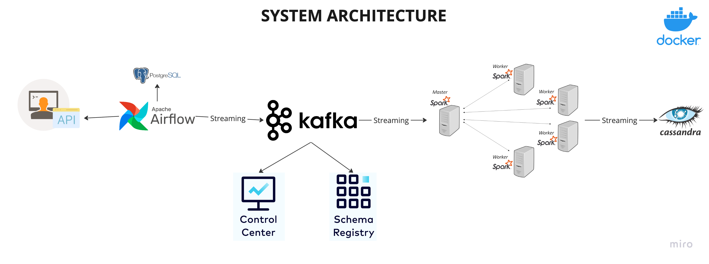
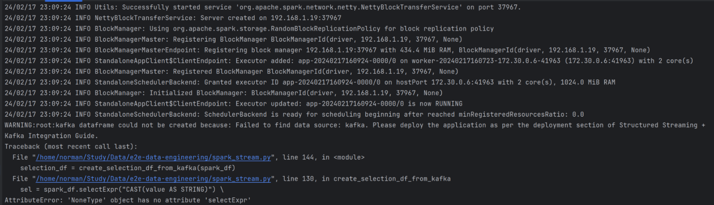
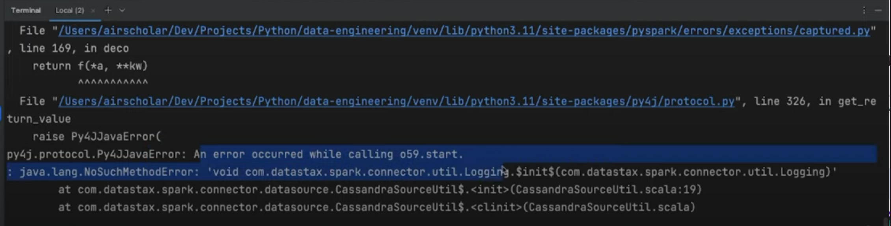
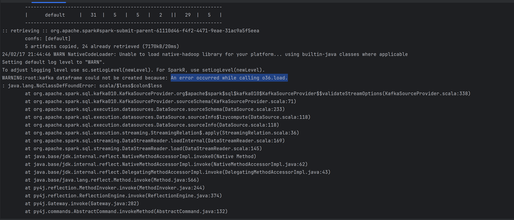
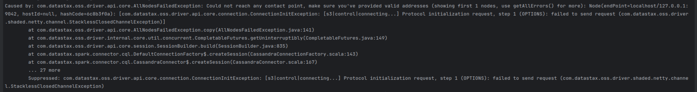

# Real-time Data Streaming | End-to-End Data Engineer Project

---

## Table of Contents
1. [Project Overview](#project-overview)
2. [System Architecture](#system-architecture)
3. [Installation](#installation)
4. [Acknowledgements](#acknowledgements)
5. [Development Challenges - What I have learned during this project](#development-challenges)
    1. [Failed to find data source: kafka](#1-failed-to-find-data-source-kafka-due-to-using-latest-version-airflow-docker-image--docker-composeyml-of-apache-airflow-instead-of-suggested-version)
    2. [Failed to submit the job to the Spark cluster](#2-failed-to-submit-the-job-to-the-spark-cluster-due-to-missing-jarspackages)
    3. [Failed connection between Spark and Cassandra](#3-failed-connection-between-spark-and-cassandra)
---

## Project Overview
This project serves as a comprehensive guide for building a complete data engineering pipeline, covering every phase
from data ingestion to processing and storage. It leverages a resilient technology stack that includes Apache Airflow,
Python, Apache Kafka + Kraft, Apache Spark, and Cassandra. The entire system is containerized using Docker for easy
deployment and enhanced scalability.
---

## System Architecture
   

The project is structured around several key components:

- **Data Source**: Utilizing the `randomuser.me` API, we generate random user data to feed into our pipeline.
- **Apache Airflow**: This orchestrates the pipeline and stores the fetched data within a PostgreSQL database.
- **Apache Kafka and Zookeeper**: These are employed to stream data from PostgreSQL to the processing engine.
- **Control Center and Schema Registry**: These aid in monitoring and managing schemas for our Kafka streams.
- **Apache Spark**: Handling data processing via its master and worker nodes.
- **Cassandra**: Serving as the storage destination for the processed data.
---

## Installation
To get started with the project, follow these steps:

1. Clone the repository:
   ```bash
   git clone https://github.com/jeffphan8816/data-engineer
   ```

2. Navigate to the project directory:
   ```bash
   cd data-engineer

3. Ensure the proper configuration by setting the Airflow user:
    1. Create necessary directories:
       ```bash
       mkdir -p ./dags ./logs ./plugins ./config
       ```
    2. Set the Airflow user in the .env file:
       ```bash
       echo -e "AIRFLOW_UID=$(id -u)" > .env
       ```
       
4. Run Docker Compose to spin up the services:
   ```bash
   docker-compose up
   ```
## Acknowledgements
This project was inspired by the [Realtime Data Streaming | End To End Data Engineering Project](https://www.youtube.com/watch?v=GqAcTrqKcrY) course on YouTube.

## Development Challenges
During the development of this project, I encountered several challenges that are important to highlight. Understanding these challenges may help users in troubleshooting or overcoming similar issues.
If you encounter same issues or have questions while working with the project, refer to the following troubleshooting tips or seek help through the provided channels.

### What I've encountered
#### 1. Failed to find data source: kafka due to using latest version Airflow Docker Image & docker-compose.yml of Apache Airflow instead of suggested version

   - **Possible Issue:**
     - The latest version of Airflow Docker image does not include the Kafka package.
     - Unable to install the Kafka package using the `entrypoint.sh` file.
     - Unable to install Java 11 in Airflow docker container using the `entrypoint.sh` file.

   - **Solution:**
     - Build a custom Airflow image that includes the Kafka package and Java 11 by using my Dockerfile.
     - Comment out "image: ${AIRFLOW_IMAGE_NAME:-apache/airflow:2.8.1}" and uncomment "build: ." at the line below in docker-compose.yml. Then run `docker-compose build` to build the image.
     - Rerun docker compose up to ensure that the Kafka package is installed correctly.


#### 2. Failed to submit the job to the Spark cluster due to missing jars/packages

or

   - **Possible Issue:**
     - Unmatched Spark version between the Spark cluster on docker and spark-submit command on local machine.
     - Missing packages in the Spark cluster on docker.
     - Too many versions of the same package in the Spark cluster on docker.
   - **Solution:**
     - Ensure that the Spark version on the local machine matches the Spark cluster on docker.
     - Completely remove the Spark cluster on docker and rebuild it.
     - Use the `--packages` option to specify the package version in the spark-submit command.
     - Use the `--jars` option to specify the jar file in the spark-submit command.
     - Example: `spark-submit --master spark://localhost:7077 --packages org.apache.spark:spark-sql-kafka-0-10_2.12:3.5.0,com.datastax.spark:spark-cassandra-connector_2.12:3.4.1,org.apache.kafka:kafka-clients:3.6.1,org.apache.spark:spark-streaming-kafka-0-10_2.12:3.5.0 spark_stream.py`

#### 3. Failed connection between Spark and Cassandra

   - **Possible Issue:**
     - Spark worker nodes are unable to connect to the Cassandra cluster on docker because they don't know the IP address of the Cassandra cluster.
   - **Solution:**
     - Add .master('local') to the `SparkSession.builder` in the `spark_stream.py` file.